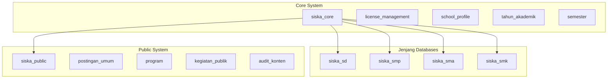
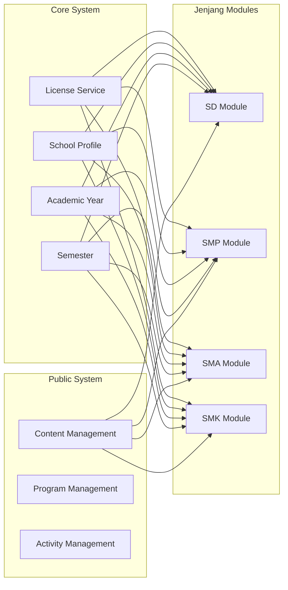
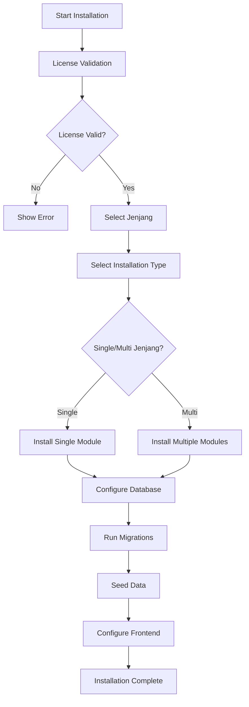
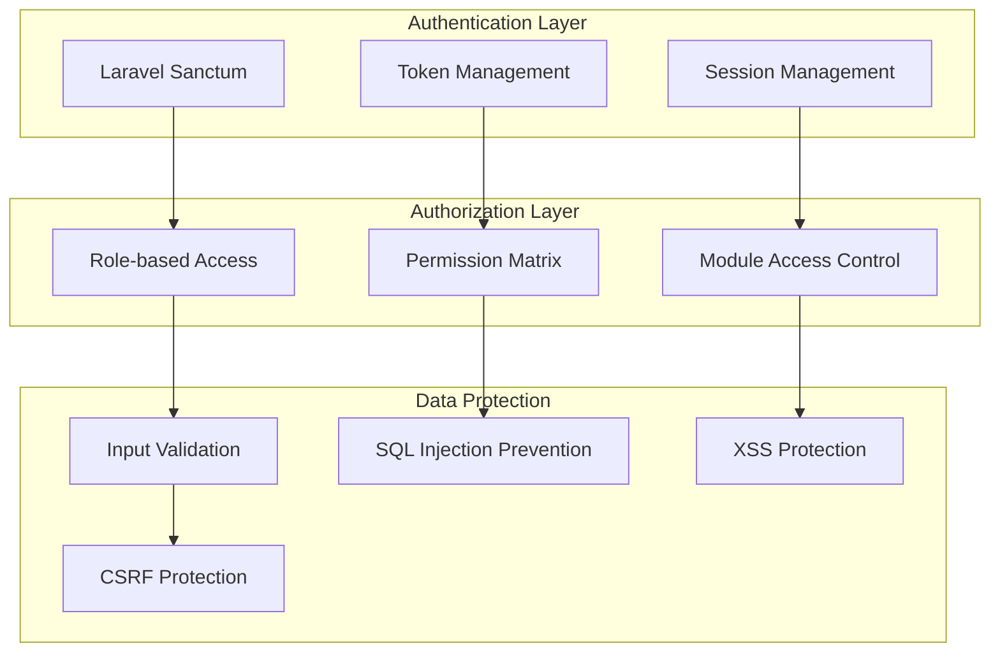
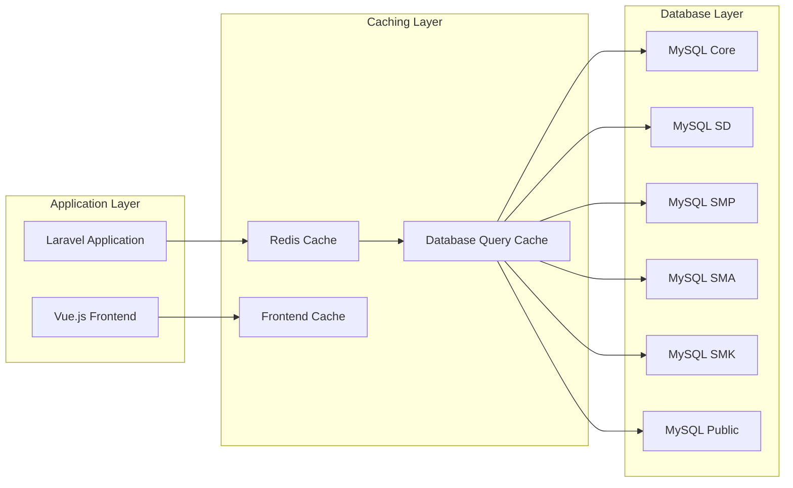
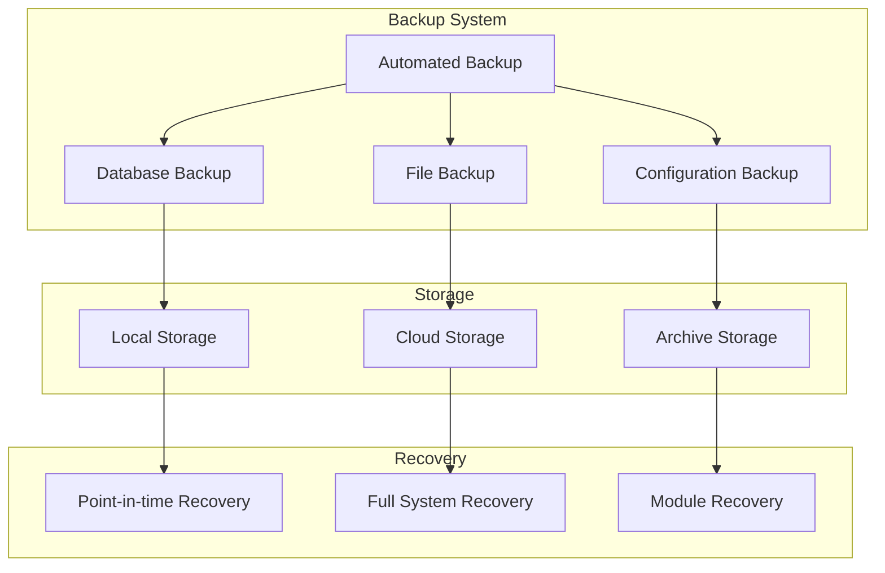
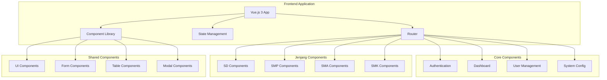
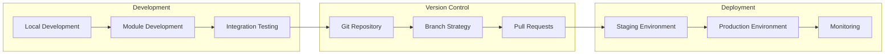
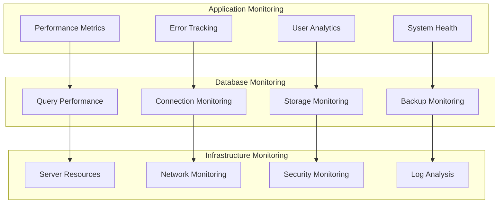

# SISKA Project Architecture - Isolated Architecture

## 📋 **INFORMASI PROYEK**

**SISKA** (Sistem Informasi Sekolah Bidang Kesiswaan)  
**Pengembang**: [jejakawan.com](https://jejakawan.com)  
**GitHub**: [@jejak-awan](https://github.com/jejak-awan) | [@k2netid](https://github.com/k2netid)  
**Supported by**: **K2NET** - PT. Kirana Karina Network  
*"Provide Different IT Solutions"*

## 🏗️ **ARCHITECTURE OVERVIEW**

### **Isolated Architecture Principles**

SISKA menggunakan **Isolated Architecture** yang memungkinkan setiap jenjang pendidikan (SD, SMP, SMA, SMK) memiliki modul terpisah dengan database isolated, namun tetap menggunakan core system yang shared.

#### **Key Benefits:**
- **Scalability**: Setiap jenjang dapat dikembangkan secara independen
- **Maintainability**: Perubahan di satu jenjang tidak mempengaruhi jenjang lain
- **Performance**: Database terpisah untuk performa optimal
- **Flexibility**: Instalasi dinamis berdasarkan kebutuhan sekolah

## 🗄️ **DATABASE ARCHITECTURE**

### **Database Strategy**



### **Database Isolation**

#### **Core Database (`siska_core`)**
- **Purpose**: Shared system configuration
- **Tables**: License management, school profile, academic years, semesters
- **Access**: All jenjang modules

#### **Jenjang Databases**
- **SD Database (`siska_sd`)**: SD-specific data and models
- **SMP Database (`siska_smp`)**: SMP-specific data and models
- **SMA Database (`siska_sma`)**: SMA-specific data and models
- **SMK Database (`siska_smk`)**: SMK-specific data and models

#### **Public Database (`siska_public`)**
- **Purpose**: Shared public content
- **Tables**: Public posts, programs, activities, content audit
- **Access**: All modules for public content

## 🏛️ **APPLICATION ARCHITECTURE**

### **Workspace Structure**

```
siska/
├── core/                       # Core system (shared)
│   ├── app/
│   │   ├── Controllers/
│   │   │   ├── Core/          # License, School Profile, etc.
│   │   │   └── Public/        # Public content management
│   │   ├── Models/
│   │   │   ├── Core/          # Core models
│   │   │   └── Public/        # Public models
│   │   └── Services/
│   │       ├── Core/          # Core services
│   │       └── Public/        # Public services
│   ├── config/                # Core configuration
│   ├── database/
│   │   ├── migrations/
│   │   │   ├── core/          # Core migrations
│   │   │   └── public/        # Public migrations
│   │   └── seeders/
│   │       ├── core/          # Core seeders
│   │       └── public/        # Public seeders
│   └── routes/                # Core routes
├── jenjang/                   # Jenjang modules (isolated)
│   ├── sd/                    # SD module
│   │   ├── app/
│   │   │   ├── Controllers/
│   │   │   ├── Models/
│   │   │   └── Services/
│   │   ├── database/
│   │   │   ├── migrations/
│   │   │   └── seeders/
│   │   └── routes/
│   ├── smp/                   # SMP module
│   ├── sma/                   # SMA module
│   └── smk/                   # SMK module
├── public/                    # Public system (shared)
│   ├── app/
│   ├── config/
│   ├── database/
│   └── routes/
├── installer/                 # Installation wizard
│   ├── app/
│   ├── config/
│   └── resources/
├── shared/                    # Shared components
│   ├── components/
│   ├── utilities/
│   ├── styles/
│   └── assets/
├── frontend/                  # Frontend (all modules)
│   ├── src/
│   │   ├── components/
│   │   │   ├── core/
│   │   │   ├── jenjang/
│   │   │   ├── public/
│   │   │   └── installer/
│   │   ├── views/
│   │   ├── stores/
│   │   ├── services/
│   │   └── utils/
│   ├── assets/
│   └── public/
└── docs/                      # Documentation
    ├── skema-database-isolated.md
    ├── struktur-aplikasi-isolated.md
    ├── strategi-git-integration.md
    └── ...
```

## 🔄 **MODULE INTERACTION**

### **Core System Integration**



### **Data Flow**

1. **Core System** provides shared services
2. **Jenjang Modules** consume core services
3. **Public System** provides content for all modules
4. **Shared Components** provide reusable functionality

## 🚀 **INSTALLATION ARCHITECTURE**

### **Installation Wizard Flow**



### **Dynamic Installation**

- **Single Jenjang**: Install only required module
- **Multi Jenjang**: Install multiple modules as needed
- **Core System**: Always installed
- **Public System**: Always installed
- **Frontend**: Configured based on installed modules

## 🔐 **SECURITY ARCHITECTURE**

### **Authentication & Authorization**



### **Security Features**

- **Multi-role Authentication**: Role-based access control
- **Token-based Security**: Secure API authentication
- **Database Isolation**: Separate databases for security
- **Input Validation**: Comprehensive input validation
- **Audit Logging**: Complete audit trail

## 📊 **PERFORMANCE ARCHITECTURE**

### **Caching Strategy**



### **Performance Optimization**

- **Database Indexing**: Optimized indexes per database
- **Query Optimization**: Efficient queries with proper joins
- **Caching**: Redis for application caching
- **Lazy Loading**: Frontend lazy loading
- **Code Splitting**: Modular frontend loading

## 🔄 **BACKUP & RECOVERY ARCHITECTURE**

### **Backup Strategy**



### **Recovery Options**

- **Full System Recovery**: Complete system restoration
- **Module Recovery**: Individual module restoration
- **Database Recovery**: Database-specific recovery
- **File Recovery**: File and media recovery

## 🌐 **API ARCHITECTURE**

### **API Structure**

```mermaid
graph TB
    subgraph "API Gateway"
        A[API Gateway]
        B[Rate Limiting]
        C[Authentication]
        D[Request Routing]
    end
    
    subgraph "Core APIs"
        E[/api/core/*]
        F[License APIs]
        G[School Profile APIs]
        H[Academic APIs]
    end
    
    subgraph "Jenjang APIs"
        I[/api/sd/*]
        J[/api/smp/*]
        K[/api/sma/*]
        L[/api/smk/*]
    end
    
    subgraph "Public APIs"
        M[/api/public/*]
        N[Content APIs]
        O[Program APIs]
        P[Activity APIs]
    end
    
    A --> B
    B --> C
    C --> D
    D --> E
    D --> I
    D --> J
    D --> K
    D --> L
    D --> M
    E --> F
    E --> G
    E --> H
    M --> N
    M --> O
    M --> P
```

### **API Features**

- **RESTful Design**: Standard REST API design
- **Versioning**: API versioning for compatibility
- **Documentation**: Swagger/OpenAPI documentation
- **Rate Limiting**: Request rate limiting
- **Authentication**: Token-based authentication

## 📱 **FRONTEND ARCHITECTURE**

### **Component Structure**



### **Frontend Features**

- **Vue.js 3**: Modern JavaScript framework
- **Composition API**: Reactive component system
- **TypeScript**: Type-safe development
- **Tailwind CSS**: Utility-first styling
- **Pinia**: State management
- **Vite**: Fast build tool

## 🔧 **DEVELOPMENT ARCHITECTURE**

### **Development Workflow**



### **Development Tools**

- **Git**: Version control with branch strategy
- **Composer**: PHP dependency management
- **NPM**: Node.js package management
- **Docker**: Containerization
- **Testing**: PHPUnit, Vue Test Utils
- **Linting**: Code quality tools

## 📈 **MONITORING & ANALYTICS**

### **Monitoring Architecture**



### **Monitoring Features**

- **Performance Metrics**: Application performance tracking
- **Error Tracking**: Error logging and analysis
- **User Analytics**: User behavior analysis
- **System Health**: System status monitoring
- **Database Monitoring**: Database performance tracking
- **Security Monitoring**: Security event tracking

## 🎯 **SCALABILITY CONSIDERATIONS**

### **Horizontal Scaling**

- **Load Balancing**: Multiple server instances
- **Database Sharding**: Database distribution
- **CDN Integration**: Content delivery optimization
- **Microservices**: Service decomposition

### **Vertical Scaling**

- **Resource Optimization**: Server resource optimization
- **Database Optimization**: Query and index optimization
- **Caching**: Multi-level caching strategy
- **Code Optimization**: Performance code optimization

## 🔮 **FUTURE ARCHITECTURE**

### **Planned Enhancements**

- **Microservices**: Service decomposition
- **Event-driven Architecture**: Event-based communication
- **AI Integration**: Machine learning capabilities
- **Mobile Apps**: Native mobile applications
- **Cloud Integration**: Cloud-native deployment

### **Technology Roadmap**

- **Laravel 12**: Framework updates
- **Vue.js 4**: Frontend framework updates
- **MySQL 9**: Database updates
- **Redis 7**: Caching updates
- **Docker**: Containerization improvements

---

**SISKA** - Architecture yang scalable, maintainable, dan future-proof! 🏗️✨
