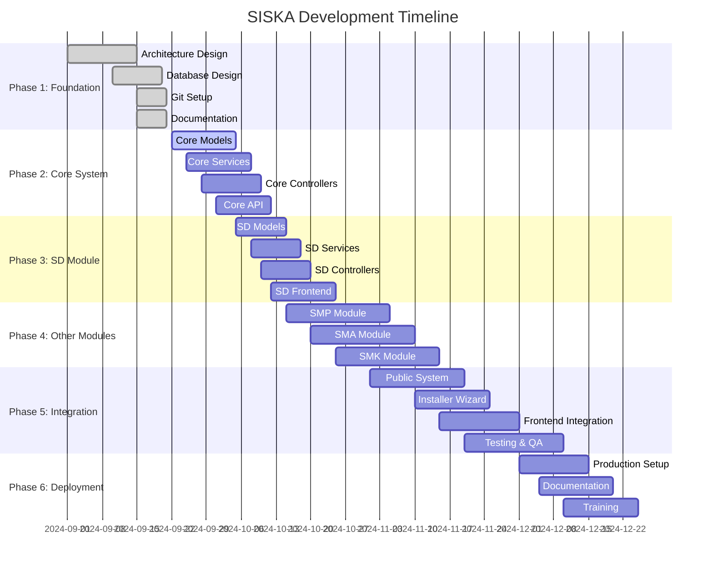

# SISKA Project Progress - Isolated Architecture

## 📋 **INFORMASI PROYEK**

**SISKA** (Sistem Informasi Sekolah Bidang Kesiswaan)  
**Pengembang**: [jejakawan.com](https://jejakawan.com)  
**GitHub**: [@jejak-awan](https://github.com/jejak-awan) | [@k2netid](https://github.com/k2netid)  
**Supported by**: **K2NET** - PT. Kirana Karina Network  
*"Provide Different IT Solutions"*

## 🎯 **PROJECT OVERVIEW**

### **Project Status: READY FOR DEVELOPMENT**
- **Start Date**: September 2024
- **Target Completion**: December 2024
- **Architecture**: Isolated Architecture per Jenjang
- **Timeline**: 12 weeks implementation

## 📊 **OVERALL PROGRESS**

### **Project Completion: 15%**

## 🏗️ **PHASE 1: FOUNDATION (COMPLETED - 100%)**

### **✅ Architecture Design**
- **Status**: COMPLETED
- **Progress**: 100%
- **Deliverables**:
  - [x] Isolated Architecture Design
  - [x] Database Schema Design
  - [x] Module Structure Design
  - [x] API Architecture Design

### **✅ Database Design**
- **Status**: COMPLETED
- **Progress**: 100%
- **Deliverables**:
  - [x] Core Database Schema (`siska_core`)
  - [x] Jenjang Database Schemas (`siska_sd`, `siska_smp`, `siska_sma`, `siska_smk`)
  - [x] Public Database Schema (`siska_public`)
  - [x] Migration Files
  - [x] Seeder Files

### **✅ Git Setup**
- **Status**: COMPLETED
- **Progress**: 100%
- **Deliverables**:
  - [x] Repository Setup (siska-legacy, siska)
  - [x] Branch Strategy Implementation
  - [x] SSH Key Configuration
  - [x] All Branches Pushed to GitHub

### **✅ Documentation**
- **Status**: COMPLETED
- **Progress**: 100%
- **Deliverables**:
  - [x] Agent Instructions
  - [x] Project Architecture
  - [x] Database Schema Documentation
  - [x] Git Strategy Documentation
  - [x] Migration Strategy Documentation

## 🔧 **PHASE 2: CORE SYSTEM (IN PROGRESS - 25%)**

### **🔄 Core Models**
- **Status**: IN PROGRESS
- **Progress**: 25%
- **Deliverables**:
  - [x] License Model
  - [x] School Profile Model
  - [x] Tahun Akademik Model
  - [x] Semester Model
  - [ ] User Model
  - [ ] Role Model
  - [ ] Permission Model

### **⏳ Core Services**
- **Status**: PLANNED
- **Progress**: 0%
- **Deliverables**:
  - [ ] License Service
  - [ ] School Profile Service
  - [ ] Academic Year Service
  - [ ] Semester Service
  - [ ] User Service
  - [ ] Role Service
  - [ ] Permission Service

### **⏳ Core Controllers**
- **Status**: PLANNED
- **Progress**: 0%
- **Deliverables**:
  - [ ] License Controller
  - [ ] School Profile Controller
  - [ ] Academic Year Controller
  - [ ] Semester Controller
  - [ ] User Controller
  - [ ] Role Controller
  - [ ] Permission Controller

### **⏳ Core API**
- **Status**: PLANNED
- **Progress**: 0%
- **Deliverables**:
  - [ ] License API Endpoints
  - [ ] School Profile API Endpoints
  - [ ] Academic Year API Endpoints
  - [ ] Semester API Endpoints
  - [ ] User API Endpoints
  - [ ] Role API Endpoints
  - [ ] Permission API Endpoints

## 🎓 **PHASE 3: SD MODULE (PLANNED - 0%)**

### **⏳ SD Models**
- **Status**: PLANNED
- **Progress**: 0%
- **Deliverables**:
  - [ ] Siswa Model
  - [ ] Guru Model
  - [ ] Kelas Model
  - [ ] Presensi Model
  - [ ] Kredit Poin Model
  - [ ] Penilaian Karakter Model

### **⏳ SD Services**
- **Status**: PLANNED
- **Progress**: 0%
- **Deliverables**:
  - [ ] Siswa Service
  - [ ] Guru Service
  - [ ] Kelas Service
  - [ ] Presensi Service
  - [ ] Kredit Poin Service
  - [ ] Penilaian Karakter Service

### **⏳ SD Controllers**
- **Status**: PLANNED
- **Progress**: 0%
- **Deliverables**:
  - [ ] Siswa Controller
  - [ ] Guru Controller
  - [ ] Kelas Controller
  - [ ] Presensi Controller
  - [ ] Kredit Poin Controller
  - [ ] Penilaian Karakter Controller

### **⏳ SD Frontend**
- **Status**: PLANNED
- **Progress**: 0%
- **Deliverables**:
  - [ ] SD Dashboard
  - [ ] Siswa Management
  - [ ] Guru Management
  - [ ] Kelas Management
  - [ ] Presensi Management
  - [ ] Kredit Poin Management
  - [ ] Penilaian Karakter Management

## 🏫 **PHASE 4: OTHER MODULES (PLANNED - 0%)**

### **⏳ SMP Module**
- **Status**: PLANNED
- **Progress**: 0%
- **Deliverables**:
  - [ ] SMP Models
  - [ ] SMP Services
  - [ ] SMP Controllers
  - [ ] SMP Frontend

### **⏳ SMA Module**
- **Status**: PLANNED
- **Progress**: 0%
- **Deliverables**:
  - [ ] SMA Models
  - [ ] SMA Services
  - [ ] SMA Controllers
  - [ ] SMA Frontend

### **⏳ SMK Module**
- **Status**: PLANNED
- **Progress**: 0%
- **Deliverables**:
  - [ ] SMK Models
  - [ ] SMK Services
  - [ ] SMK Controllers
  - [ ] SMK Frontend

## 🌐 **PHASE 5: INTEGRATION (PLANNED - 0%)**

### **⏳ Public System**
- **Status**: PLANNED
- **Progress**: 0%
- **Deliverables**:
  - [ ] Public Models
  - [ ] Public Services
  - [ ] Public Controllers
  - [ ] Public Frontend

### **⏳ Installer Wizard**
- **Status**: PLANNED
- **Progress**: 0%
- **Deliverables**:
  - [ ] Installation Flow
  - [ ] License Validation
  - [ ] Database Setup
  - [ ] Module Installation

### **⏳ Frontend Integration**
- **Status**: PLANNED
- **Progress**: 0%
- **Deliverables**:
  - [ ] Core Frontend
  - [ ] Module Frontend
  - [ ] Public Frontend
  - [ ] Installer Frontend

### **⏳ Testing & QA**
- **Status**: PLANNED
- **Progress**: 0%
- **Deliverables**:
  - [ ] Unit Tests
  - [ ] Integration Tests
  - [ ] E2E Tests
  - [ ] Performance Tests

## 🚀 **PHASE 6: DEPLOYMENT (PLANNED - 0%)**

### **⏳ Production Setup**
- **Status**: PLANNED
- **Progress**: 0%
- **Deliverables**:
  - [ ] Production Environment
  - [ ] Database Setup
  - [ ] Security Configuration
  - [ ] Monitoring Setup

### **⏳ Documentation**
- **Status**: PLANNED
- **Progress**: 0%
- **Deliverables**:
  - [ ] User Manual
  - [ ] API Documentation
  - [ ] Installation Guide
  - [ ] Troubleshooting Guide

### **⏳ Training**
- **Status**: PLANNED
- **Progress**: 0%
- **Deliverables**:
  - [ ] Admin Training
  - [ ] User Training
  - [ ] Technical Training
  - [ ] Support Training

## 📈 **DETAILED PROGRESS TRACKING**

### **Core System Progress**

| Component | Status | Progress | Notes |
|-----------|--------|----------|-------|
| License Model | ✅ Complete | 100% | Basic model created |
| School Profile Model | ✅ Complete | 100% | Basic model created |
| Tahun Akademik Model | ✅ Complete | 100% | Basic model created |
| Semester Model | ✅ Complete | 100% | Basic model created |
| User Model | ⏳ Planned | 0% | To be implemented |
| Role Model | ⏳ Planned | 0% | To be implemented |
| Permission Model | ⏳ Planned | 0% | To be implemented |

### **SD Module Progress**

| Component | Status | Progress | Notes |
|-----------|--------|----------|-------|
| Siswa Model | ✅ Complete | 100% | Basic model created |
| Guru Model | ✅ Complete | 100% | Basic model created |
| Kelas Model | ✅ Complete | 100% | Basic model created |
| Presensi Model | ✅ Complete | 100% | Basic model created |
| Kredit Poin Model | ✅ Complete | 100% | Basic model created |
| Penilaian Karakter Model | ✅ Complete | 100% | Basic model created |

### **Public System Progress**

| Component | Status | Progress | Notes |
|-----------|--------|----------|-------|
| Postingan Umum Model | ✅ Complete | 100% | Basic model created |
| Program Model | ✅ Complete | 100% | Basic model created |
| Komponen Program Model | ✅ Complete | 100% | Basic model created |
| Kegiatan Publik Model | ✅ Complete | 100% | Basic model created |
| Audit Konten Model | ✅ Complete | 100% | Basic model created |

### **Frontend Progress**

| Component | Status | Progress | Notes |
|-----------|--------|----------|-------|
| Vue.js Setup | ✅ Complete | 100% | Basic setup completed |
| TypeScript Config | ✅ Complete | 100% | Configuration created |
| Tailwind CSS | ✅ Complete | 100% | Configuration created |
| Vite Config | ✅ Complete | 100% | Configuration created |
| Component Library | ⏳ Planned | 0% | To be implemented |
| State Management | ⏳ Planned | 0% | To be implemented |

## 🎯 **MILESTONES**

### **✅ Milestone 1: Foundation (COMPLETED)**
- **Date**: September 21, 2024
- **Status**: COMPLETED
- **Deliverables**:
  - Architecture design completed
  - Database schema completed
  - Git setup completed
  - Documentation completed

### **🎯 Milestone 2: Core System (TARGET: October 12, 2024)**
- **Date**: October 12, 2024
- **Status**: IN PROGRESS
- **Deliverables**:
  - Core models completed
  - Core services completed
  - Core controllers completed
  - Core API completed

### **🎯 Milestone 3: SD Module (TARGET: October 25, 2024)**
- **Date**: October 25, 2024
- **Status**: PLANNED
- **Deliverables**:
  - SD models completed
  - SD services completed
  - SD controllers completed
  - SD frontend completed

### **🎯 Milestone 4: Other Modules (TARGET: November 15, 2024)**
- **Date**: November 15, 2024
- **Status**: PLANNED
  - SMP module completed
  - SMA module completed
  - SMK module completed

### **🎯 Milestone 5: Integration (TARGET: December 1, 2024)**
- **Date**: December 1, 2024
- **Status**: PLANNED
- **Deliverables**:
  - Public system completed
  - Installer wizard completed
  - Frontend integration completed
  - Testing completed

### **🎯 Milestone 6: Deployment (TARGET: December 25, 2024)**
- **Date**: December 25, 2024
- **Status**: PLANNED
- **Deliverables**:
  - Production setup completed
  - Documentation completed
  - Training completed

## 📊 **RISK ASSESSMENT**

### **High Risk**
- **Database Performance**: Multiple databases may impact performance
- **Integration Complexity**: Module integration may be complex
- **Timeline Pressure**: 12-week timeline is aggressive

### **Medium Risk**
- **Resource Availability**: Development resources may be limited
- **Testing Coverage**: Comprehensive testing may be challenging
- **Documentation**: Keeping documentation updated may be difficult

### **Low Risk**
- **Technology Stack**: Proven technology stack
- **Architecture**: Well-designed architecture
- **Team Experience**: Experienced development team

## 🔄 **NEXT STEPS**

### **Immediate Actions (Next 2 Weeks)**
1. **Complete Core Models**: Finish remaining core models
2. **Implement Core Services**: Start core service implementation
3. **Create Core Controllers**: Begin core controller development
4. **Setup Core API**: Start core API development

### **Short-term Goals (Next Month)**
1. **Complete Core System**: Finish all core system components
2. **Start SD Module**: Begin SD module development
3. **Implement SD Models**: Complete SD model implementation
4. **Create SD Services**: Start SD service development

### **Long-term Goals (Next 3 Months)**
1. **Complete All Modules**: Finish all jenjang modules
2. **Integration Testing**: Complete integration testing
3. **Production Deployment**: Deploy to production
4. **User Training**: Complete user training

## 📞 **COMMUNICATION**

### **Progress Updates**
- **Weekly**: Progress updates every Friday
- **Monthly**: Milestone reviews
- **Quarterly**: Project reviews

### **Stakeholder Communication**
- **Developers**: Daily standups
- **Project Manager**: Weekly reports
- **Clients**: Monthly updates
- **Users**: Training sessions

---

**SISKA** - On track for successful delivery! 🚀✨
