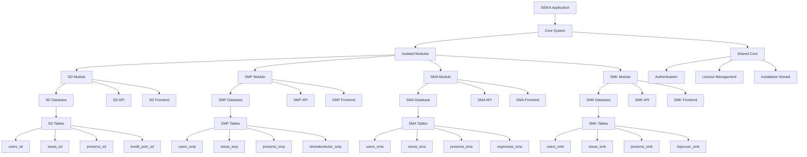
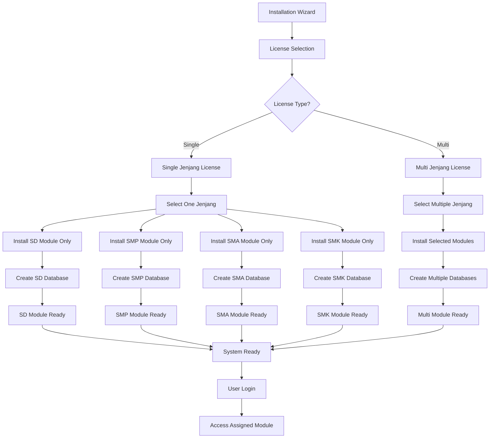
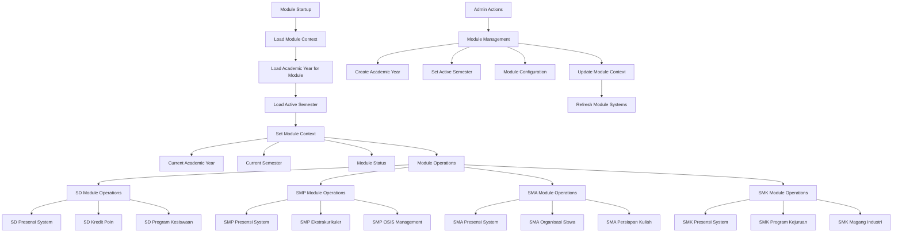
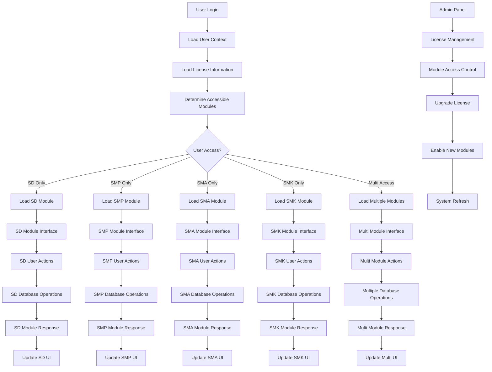

# 📊 **DIAGRAM ALIR STRATEGI MULTI-JENJANG PENDIDIKAN**

## 📋 **INFORMASI PROYEK**

**SISKA** (Sistem Informasi Sekolah Bidang Kesiswaan)  
**Pengembang**: [jejakawan.com](https://jejakawan.com)  
**GitHub**: [@jejak-awan](https://github.com/jejak-awan) | [@k2netid](https://github.com/k2netid)  
**Supported by**: **K2NET** - PT. Kirana Karina Network  
*"Provide Different IT Solutions"*

## 🎯 **RINGKASAN STRATEGI**

### **3 POIN UTAMA:**
1. **Arsitektur Fleksibel & Modular**
2. **Sistem Konfigurasi Dinamis** 
3. **Manajemen Tahun Akademik & Semester**

### **📚 KONTEKS PROGRAM KESISWAAN PER JENJANG:**
- **SD**: Program karakter dasar, kebersihan, kedisiplinan sederhana
- **SMP**: Program OSIS, ekstrakurikuler, kepemimpinan dasar
- **SMA**: Program OSIS lanjutan, organisasi siswa, persiapan kuliah
- **SMK**: Program kejuruan, magang industri, sertifikasi kompetensi

### **🎓 FOKUS AKADEMIK DALAM KONTEKS KESISWAAN:**
- **Data Keakademikan**: Nilai, presensi, mata pelajaran, kelas
- **Monitoring Prestasi**: Tracking pencapaian akademik siswa
- **Intervensi Akademik**: Program bimbingan belajar, remedial
- **Laporan Akademik**: Rapor, transkrip, sertifikat prestasi
- **Bukan**: Pengembangan kurikulum, silabus, RPP

### **⭐ FOKUS PENILAIAN KARAKTER:**
- **Penilaian Karakter**: Berdasarkan program kesiswaan yang diterapkan
- **Nilai-nilai Karakter**: Dapat diupdate menyesuaikan perubahan kurikulum
- **Dinamis**: Tidak terpaku pada perubahan kurikulum nasional
- **Fleksibel**: Mengikuti nilai-nilai karakter secara umum
- **Bukan**: Penilaian akademik mata pelajaran

---

## 🔄 **DIAGRAM ALIR 1: ARSITEKTUR ISOLATED JENJANG**



---

## 🏫 **DIAGRAM ALIR 2: WIZARD INSTALLASI ISOLATED**



---

## 📅 **DIAGRAM ALIR 3: MANAJEMEN TAHUN AKADEMIK ISOLATED**



---

## 🔗 **DIAGRAM ALIR 4: INTEGRASI ISOLATED LENGKAP**



---

## 📋 **IMPLEMENTASI SKEMA DATABASE ISOLATED**

### **Database Terpisah per Jenjang:**
```sql
-- Database SD
CREATE DATABASE kesiswaan_sd;
USE kesiswaan_sd;

-- Tabel SD
users_sd (
    id, nama, email, password, jenis_user, status
)

siswa_sd (
    id, id_user, nis, nisn, nama, kelas, status
)

presensi_sd (
    id, id_siswa, tanggal, status, keterangan
)

kredit_poin_sd (
    id, id_siswa, poin, kategori, deskripsi, tanggal
)

-- Database SMP
CREATE DATABASE kesiswaan_smp;
USE kesiswaan_smp;

-- Tabel SMP
users_smp (
    id, nama, email, password, jenis_user, status
)

siswa_smp (
    id, id_user, nis, nisn, nama, kelas, status
)

presensi_smp (
    id, id_siswa, tanggal, status, keterangan
)

ekstrakurikuler_smp (
    id, nama, pembina, jadwal, kapasitas
)

-- Database SMA
CREATE DATABASE kesiswaan_sma;
USE kesiswaan_sma;

-- Tabel SMA
users_sma (
    id, nama, email, password, jenis_user, status
)

siswa_sma (
    id, id_user, nis, nisn, nama, kelas, status
)

organisasi_sma (
    id, nama_organisasi, ketua, anggota, program_kerja
)

-- Database SMK
CREATE DATABASE kesiswaan_smk;
USE kesiswaan_smk;

-- Tabel SMK
users_smk (
    id, nama, email, password, jenis_user, status
)

siswa_smk (
    id, id_user, nis, nisn, nama, kelas, status
)

kejuruan_smk (
    id, nama_kejuruan, kompetensi, magang_industri
)
```

---

## 🎯 **KEUNTUNGAN STRATEGI ISOLATED:**

1. **Complete Isolation**: Tidak ada konflik antar jenjang
2. **License-Based**: Upgrade berdasarkan lisensi
3. **Modular Installation**: Install hanya yang diperlukan
4. **Easy Maintenance**: Maintenance per jenjang terpisah
5. **Scalable**: Mudah menambah jenjang baru
6. **Secure**: Isolasi data per jenjang
7. **Performance**: Tidak ada overhead dari jenjang lain
8. **Flexible**: Dapat digunakan single atau multi jenjang

---

## 🚀 **LANGKAH SELANJUTNYA:**

1. **Implementasi Wizard Installasi**
2. **Buat License Management System**
3. **Implementasi Isolated Database Schema**
4. **Buat Module per Jenjang**
5. **Implementasi Upgrade System**
6. **Testing & Deployment**

---

## 📋 **CONTOH IMPLEMENTASI PROGRAM KESISWAAN:**

### **Database Schema:**
```sql
-- Tabel Program Kesiswaan
program_kesiswaan (
    id, id_sekolah, jenjang, nama_program,
    deskripsi, kategori, target_siswa,
    durasi, penanggung_jawab, status
)

-- Tabel Kategori Program Kesiswaan
kategori_program_kesiswaan (
    id, jenjang, nama_kategori, 
    deskripsi, aturan_poin, status
)

-- Tabel Data Akademik Siswa
data_akademik_siswa (
    id, id_siswa, id_mata_pelajaran, 
    nilai_pengetahuan, nilai_keterampilan, 
    nilai_sikap, semester, tahun_akademik
)

-- Tabel Monitoring Prestasi
monitoring_prestasi (
    id, id_siswa, jenis_prestasi, 
    deskripsi, tanggal, tingkat, 
    penghargaan, status
)

-- Tabel Penilaian Karakter
penilaian_karakter (
    id, id_siswa, id_program_kesiswaan,
    aspek_karakter, nilai_karakter, 
    deskripsi, tanggal_penilaian, 
    penilai, semester, tahun_akademik
)

-- Tabel Aspek Karakter (Dinamis)
aspek_karakter (
    id, jenjang, nama_aspek, 
    deskripsi, indikator, 
    skala_nilai, status, 
    tanggal_update
)

-- Contoh Data per Jenjang:
-- SD: 'karakter_dasar', 'kebersihan', 'kedisiplinan'
-- SMP: 'osis', 'ekstrakurikuler', 'kepemimpinan'
-- SMA: 'organisasi_siswa', 'persiapan_kuliah', 'kepemimpinan_lanjutan'
-- SMK: 'kejuruan', 'magang_industri', 'sertifikasi'

-- Contoh Aspek Karakter (Dinamis):
-- SD: 'jujur', 'disiplin', 'tanggung_jawab', 'santun'
-- SMP: 'jujur', 'disiplin', 'tanggung_jawab', 'santun', 'peduli', 'percaya_diri'
-- SMA: 'jujur', 'disiplin', 'tanggung_jawab', 'santun', 'peduli', 'percaya_diri', 'kreatif', 'mandiri'
-- SMK: 'jujur', 'disiplin', 'tanggung_jawab', 'santun', 'peduli', 'percaya_diri', 'kreatif', 'mandiri', 'kerja_sama'
```

### **API Endpoints:**
```php
// Program Kesiswaan per Jenjang
GET /api/program-kesiswaan/{jenjang}
POST /api/program-kesiswaan
PUT /api/program-kesiswaan/{id}
DELETE /api/program-kesiswaan/{id}

// Kategori Program per Jenjang
GET /api/kategori-program-kesiswaan/{jenjang}

// Data Akademik Siswa
GET /api/akademik/siswa/{id_siswa}
GET /api/akademik/nilai/{id_siswa}/{semester}
POST /api/akademik/nilai
PUT /api/akademik/nilai/{id}

// Monitoring Prestasi
GET /api/akademik/prestasi/{id_siswa}
POST /api/akademik/prestasi
PUT /api/akademik/prestasi/{id}

// Penilaian Karakter
GET /api/penilaian-karakter/siswa/{id_siswa}
GET /api/penilaian-karakter/aspek/{jenjang}
POST /api/penilaian-karakter
PUT /api/penilaian-karakter/{id}

// Aspek Karakter (Dinamis)
GET /api/aspek-karakter/{jenjang}
POST /api/aspek-karakter
PUT /api/aspek-karakter/{id}
DELETE /api/aspek-karakter/{id}
```
